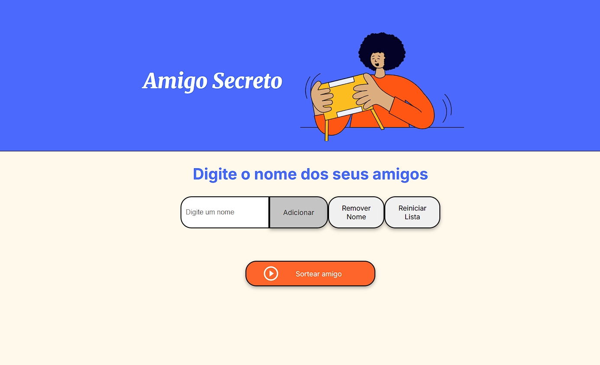

# 🎁 Amigo Secreto

Este é um projeto simples de **Amigo Secreto** feito com HTML, CSS e JavaScript. Ele permite que os usuários adicionem nomes, realizem um sorteio e visualizem o resultado diretamente na tela.

## 📌 Funcionalidades
- Adicionar participantes ao sorteio.
- Remover nomes individuais da lista.
- Reiniciar a lista de participantes.
- Sortear um nome aleatório.
- Exibir o resultado do sorteio na tela.

## 🚀 Tecnologias Utilizadas
- **HTML5** → Estrutura da página.
- **CSS3** → Estilização e layout responsivo.
- **JavaScript (ES6)** → Lógica do sorteio e manipulação do DOM.

## 🛠️ Como Rodar o Projeto
1. Clone este repositório:
   ```sh
   git clone https://github.com/CleidsonLimaB/challenge-amigo-secreto.git
   ```
2. Abra o arquivo `index.html` no navegador.
3. Adicione nomes, clique em **Sortear** e veja o resultado! 🎉


## 📷 Capturas de Tela




## 📜 Licença
Este projeto é de uso livre. Sinta-se à vontade para contribuir! 😊

